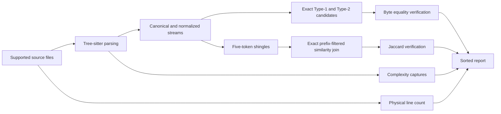

# How Aposlop works

Aposlop combines syntax-aware analysis with deterministic candidate generation.
This page explains the underlying approach without requiring knowledge of the codebase.

## File discovery

Aposlop walks one target directory and respects standard ignore files.
Aposlop keeps only Go, Rust, Python, TypeScript, and TSX files.

Aposlop runs discovery and analysis in parallel.
Aposlop sorts data at stage boundaries so worker order never changes output.

## Syntax parsing

Tree-sitter parses each supported file.
Language-specific queries select function-like blocks, identifiers, literals, comments, and complexity decisions.

A file can contain syntax errors without failing the complete command.
Aposlop keeps valid blocks and reports one file diagnostic.

## Canonical and normalized streams

The canonical stream ignores whitespace and comments while preserving identifiers and literals.
Equal canonical streams produce Type-1 duplicate relations.

The normalized stream replaces identifiers and literals with category markers.
Equal normalized streams produce Type-2 duplicate relations when canonical streams differ.

## Type-3 similarity join

Aposlop creates five-token shingles from the normalized stream.
It orders shingles by document frequency and partitions blocks by language and effective threshold.

Length filtering rejects blocks whose sizes cannot meet the Jaccard threshold.
Prefix filtering uses an inverted index to find candidate pairs that share a rare prefix shingle.
Positional filtering rejects candidate pairs that cannot accumulate enough remaining overlap.

Aposlop verifies every surviving candidate pair with exact Jaccard similarity.
These filters preserve every threshold-qualified block pair.

## Duplicate grouping

Aposlop joins enabled duplicate relations with a union-find structure.
Each connected component becomes one duplicate group.
The group retains its broadest relation type and minimum accepted relation similarity.

## Complexity

Language queries capture branches, loops, alternatives, exception paths, conditional expressions, and short-circuit Boolean operations.

Aposlop counts each syntax range once.
Every block starts with complexity `1`.

## File length

Aposlop counts physical source lines once during analysis.
Report construction compares each count with its global, language, extension, or command-line limit.
Check-specific gitignore-style patterns suppress only file-length violations.

## Cache

The local cache stores analysis results for unchanged files.
Aposlop does not cache configuration thresholds.
Users can change report settings without reparsing unchanged source.

Cache entries include file metadata and analysis schema versions.
Aposlop replaces the cache atomically after successful output.

## Deterministic reports

Aposlop sorts files, blocks, duplicate groups, complexity violations, file-length violations, and diagnostics.
Terminal and JSON output use the same report data.
