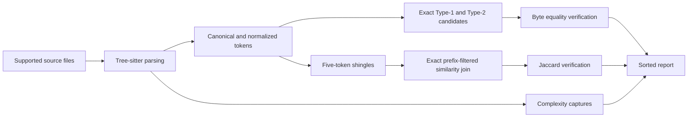

# How Aposlop works

Aposlop combines syntax-aware analysis with deterministic candidate generation.
This page explains the underlying approach without requiring knowledge of the codebase.

## File discovery

Aposlop walks one target directory and respects standard ignore files.
It keeps only Rust, Python, TypeScript, and TSX files.

Discovery and analysis run in parallel.
Aposlop sorts data at stage boundaries so worker order never changes output.

## Syntax parsing

Tree-sitter parses each supported file.
Language-specific queries select function-like blocks, identifiers, literals, comments, and complexity decisions.

A file can contain syntax errors without failing the complete command.
Aposlop keeps valid blocks and reports one file diagnostic.

## Canonical and normalized tokens

Canonical tokens ignore whitespace and comments while preserving identifiers and literals.
Equal canonical streams produce Type-1 matches.

Normalized tokens replace identifiers and literals with category markers.
Equal normalized streams produce Type-2 matches when canonical streams differ.

## Type-3 similarity join

Aposlop creates five-token shingles from normalized tokens.
It orders shingles by document frequency and partitions blocks by language and effective threshold.

Length filtering rejects blocks whose sizes cannot meet the Jaccard threshold.
Prefix filtering uses an inverted index to find pairs that must share a rare prefix shingle.
Positional filtering rejects pairs that cannot accumulate enough remaining overlap.

Aposlop verifies every surviving candidate with exact Jaccard similarity.
These filters do not discard threshold-qualified pairs.

## Complexity

Language queries capture branches, loops, alternatives, exception paths, conditional expressions, and short-circuit Boolean operations.

Aposlop counts each syntax range once.
Every block starts with complexity `1`.

## Cache

The local cache stores analysis results for unchanged files.
Configuration thresholds are not cached, so report settings can change without reparsing unchanged source.

Cache entries include file metadata and analysis schema versions.
Aposlop replaces the cache atomically after successful output.

## Deterministic reports

Aposlop sorts files, blocks, duplicate matches, complexity violations, and diagnostics.
Terminal and JSON output use the same report data.
